# Nền tảng quản lý doanh nghiệp — Mục lục và lộ trình

## Mục tiêu

Xây dựng một nền tảng quản lý tập đoàn có phân quyền theo tổ chức, nhiều vai trò cho một người dùng, luồng phê duyệt đa cấp và các phân hệ nghiệp vụ dùng chung hạ tầng dữ liệu, tài liệu, thông báo, dashboard và audit.

## Bộ tài liệu

| Tài liệu | Nội dung | Mức ưu tiên |
|---|---|---|
| 01-KIEN-TRUC-TONG-THE.md | Mô hình bài toán và kiến trúc tổng thể | Bắt buộc |
| 02-TO-CHUC-RBAC-CONTEXT.md | Tổ chức, chức danh, vai trò, quyền và context | Bắt buộc |
| 03-APPROVAL-ENGINE.md | Luồng phê duyệt dùng chung | Bắt buộc |
| 04-QUAN-LY-KHACH-HANG-TRONG-QUAN-LY-MO.md | Phân tích sâu phân hệ khách hàng trong quản lý mộ | Làm trước |
| 05-CAC-PHAN-HE-NGHIEP-VU-KHAC.md | Phòng họp, xe, mua hàng, duyệt giá | Sau nền tảng |
| 06-FILE-VA-TAI-LIEU.md | Upload file/hình ảnh | Bắt buộc |
| 07-KNOWLEDGE-BASE-MIND-MAP.md | Memory, knowledge graph, mind map | Giai đoạn sau |
| 08-DASHBOARD-BAO-CAO.md | Dashboard và KPI | Theo từng module |
| 09-TECHNOLOGY-DOCKER-DEPLOYMENT.md | Stack, local server, Docker | Bắt buộc |
| 10-SECURITY-AUDIT-TESTING.md | Bảo mật, audit và kiểm thử | Bắt buộc |
| 11-TONG-HOP-YEU-CAU-VA-GIAI-PHAP.md | Tổng hợp yêu cầu và giải pháp triển khai đầy đủ | Đọc trước khi triển khai |

## Thứ tự triển khai khuyến nghị

```mermaid
flowchart LR
  A[0. Chốt nghiệp vụ & mẫu dữ liệu] --> B[1. Nền tảng tổ chức / đăng nhập]
  B --> C[2. RBAC + organizational context]
  C --> D[3. File, audit, notification]
  D --> E[4. Quản lý khách hàng & danh mục mộ]
  E --> F[5. Hợp đồng / giữ chỗ / cấp mộ]
  F --> G[6. Approval engine]
  G --> H[7. Mua hàng, phòng họp, xe, duyệt giá]
  H --> I[8. Dashboard nâng cao]
  I --> J[9. Knowledge base / mind map / AI]
```

## Quy tắc nghiệm thu chung

Một module chỉ được coi là nghiệm thu khi đạt đủ:

1. Nghiệp vụ chính chạy được trên dữ liệu thật hoặc dữ liệu UAT.
2. Phân quyền được kiểm tra ở backend, không chỉ ẩn nút ở giao diện.
3. Lịch sử thay đổi và file đính kèm có thể truy vết.
4. Có kiểm thử các tình huống sai, trùng dữ liệu, người không có quyền và trạng thái bất thường.
5. Có hướng dẫn ngắn cho người dùng, danh mục dữ liệu mẫu và biên bản UAT ký xác nhận.
