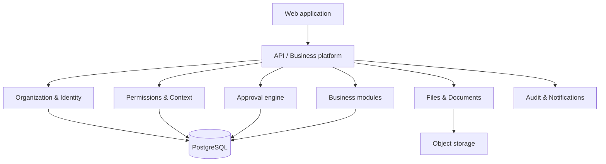

# 1. Kiến trúc nghiệp vụ tổng thể

## Các lõi dùng chung

Hệ thống gồm ba lớp:

1. **Organization & Identity:** tập đoàn, công ty, phòng ban, user, chức danh, vai trò.
2. **Authorization & Approval:** quyền thao tác, phạm vi dữ liệu, context và luồng duyệt.
3. **Business Modules:** quản lý mộ, khách hàng, phòng họp, xe, mua hàng, duyệt giá, tri thức.

## Quyết định kiến trúc

- Khởi đầu bằng **modular monolith**, không microservices.
- Một database PostgreSQL nhưng schema/module rõ ràng; mỗi module chỉ truy cập dữ liệu qua service/repository của mình.
- Approval, permission, file, audit, thông báo là dịch vụ dùng chung; không viết lại ở từng module.
- Mọi bản ghi nghiệp vụ cần có `company_id`, người tạo, thời điểm tạo/sửa, phiên bản và trạng thái.

## Các nguyên tắc không được phá vỡ

- Chức danh khác vai trò; vai trò khác quyền; quyền khác phạm vi tổ chức.
- Định nghĩa workflow được version hóa; yêu cầu đang chạy giữ workflow version lúc được gửi.
- Hành động nhạy cảm phải có audit log append-only.
- Giao diện chỉ hỗ trợ trải nghiệm; backend mới là nơi quyết định quyền.

