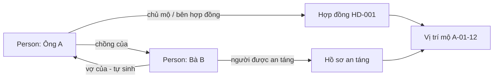
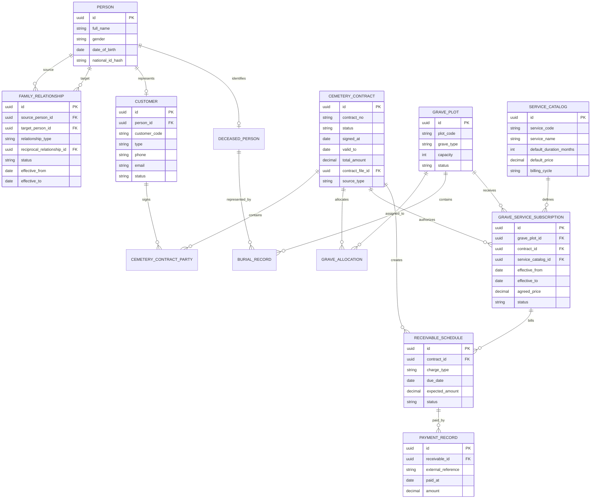

# 4. Quản lý khách hàng trong phân hệ quản lý mộ

## 1. Mục tiêu và ranh giới

Phân hệ quản lý **chủ mộ/người đại diện, người được an táng, quan hệ gia đình, vị trí mộ, hợp đồng ký ngoài hệ thống, dịch vụ chăm sóc mộ, thời hạn dịch vụ, khoản phải thu/doanh thu và chứng từ**.

Không gộp ba chủ thể sau thành một:

| Chủ thể | Vai trò | Ví dụ |
|---|---|---|
| Chủ mộ/Bên hợp đồng | Chịu trách nhiệm pháp lý hoặc thanh toán | Ông A, chồng của người mất |
| Người liên hệ | Nhận thông báo, không mặc định là chủ mộ | Con gái ông A |
| Người được an táng | Người gắn với hồ sơ mộ | Bà B, vợ ông A |

Một chủ mộ có thể có nhiều hợp đồng/mộ; một hợp đồng có nhiều bên; người được an táng có một hồ sơ an táng hiệu lực tại một thời điểm. Dịch vụ chăm sóc mộ được quản lý như một đăng ký có ngày hiệu lực, ngày hết hạn, giá và chu kỳ thu. Phần giao việc chi tiết/ảnh trước-sau có thể triển khai sau nhưng không ảnh hưởng phần theo dõi thời hạn và doanh thu.

## 2. Quan hệ gia đình

Mỗi cá nhân dùng một hồ sơ `Person` chung. Khách hàng cá nhân hoặc người được an táng liên kết vào `Person`; khách hàng tổ chức thì không có quan hệ gia đình.



### 2.1. Quan hệ ngược tự động

| Người dùng nhập | Hệ thống tự tạo/đồng bộ chiều ngược |
|---|---|
| A là chồng của B | B là vợ của A; nếu chưa xác minh giới tính, hiển thị `vợ/chồng` |
| A là vợ của B | B là chồng của A; nếu chưa xác minh giới tính, hiển thị `vợ/chồng` |
| A là cha/mẹ của B | B là con của A |
| A là con trai/con gái của B | B là phụ huynh của A; chỉ hiện cha/mẹ khi đã xác minh giới tính |
| A là anh/chị/em của B | B là anh/chị/em của A; chỉ hiện chi tiết giới tính khi có dữ liệu xác minh |

Hệ thống chỉ suy ra **quan hệ đối ứng trực tiếp, chắc chắn**. Không tự suy luận cô/dì/chú/bác, cháu, con dâu/rể hoặc quan hệ qua nhiều bước vì có thể sai và nhạy cảm.

### 2.2. Ràng buộc

- Không tạo quan hệ với chính mình.
- Không có hai quan hệ đối ứng trùng nhau trong cùng khoảng hiệu lực.
- Có trạng thái `Pending`, `Confirmed`, `Disputed`, `Ended`; ngày hiệu lực và nguồn xác minh.
- Sửa/đóng quan hệ A → B phải đồng bộ quan hệ B → A trong cùng transaction và audit cả hai event.
- Quan hệ gia đình không tự cấp quyền xem/sửa hồ sơ hay tự biến người thân thành bên hợp đồng.

## 3. Quy trình nghiệp vụ

```mermaid
flowchart LR
  A[Tiếp nhận chủ mộ/người liên hệ] --> B[Tìm trùng / tạo Person và Customer]
  B --> C[Thiết lập quan hệ gia đình]
  C --> D[Chọn và giữ chỗ mộ]
  D --> E[Upload hợp đồng ký ngoài]
  E --> F[Xác minh dữ liệu cấu trúc hợp đồng]
  F --> G[Kích hoạt hợp đồng & phân bổ mộ]
  G --> H[Hồ sơ an táng]
  H --> I[Đăng ký dịch vụ chăm sóc mộ]
  I --> J[Tự sinh lịch khoản phải thu]
  J --> K[Nhắc hết hạn / gia hạn]
  K --> L[Import/xác nhận thanh toán từ hệ thống ngoài]
  L --> M[Báo cáo doanh thu theo kỳ]
```



## 4. Danh mục nền

1. Công ty quản lý, khu nghĩa trang → phân khu → lô → dãy → vị trí mộ.
2. Loại mộ, sức chứa, trạng thái, bảng giá tham chiếu.
3. Loại khách hàng: cá nhân, tổ chức, đại lý, khách tiềm năng.
4. Loại giấy tờ và mức độ nhạy cảm.
5. Loại quan hệ và quan hệ đối ứng: spouse, parent/child, sibling.
6. Danh mục dịch vụ: chăm sóc, vệ sinh, hoa/lễ hoặc dịch vụ khác; mỗi dịch vụ có đơn vị tính và thời hạn mặc định.
7. Loại khoản thu: phí một lần, phí dịch vụ định kỳ, gia hạn, điều chỉnh.
8. Chu kỳ thu: một lần, tháng, quý, năm, tùy chỉnh.

## 5. Data model đề xuất



### Trạng thái tách riêng

| Đối tượng | Trạng thái |
|---|---|
| Vị trí mộ | Available, Held, Reserved, Allocated, Occupied, Maintenance, Locked |
| Giữ chỗ | Active, Expired, Converted, Cancelled |
| Hợp đồng upload ngoài | Uploaded, Pending Verification, Verified, Active, Expired, Replaced, Cancelled |
| Hồ sơ an táng | Draft, Verified, Scheduled, Completed, Cancelled |
| Đăng ký dịch vụ | Draft, Active, Expiring, Expired, Renewed, Suspended, Cancelled |
| Khoản phải thu | Planned, Due, Partially Paid, Paid, Overdue, Waived, Cancelled |

## 6. Các màn hình

### 6.1. Customer/Family 360

- Định danh, liên lạc, giấy tờ, người đại diện.
- Sơ đồ quan hệ gia đình; thêm/sửa quan hệ, hiển thị cặp quan hệ ngược.
- Hợp đồng, mộ và người được an táng liên quan.
- File chứng từ, timeline audit, cảnh báo trùng và hồ sơ thiếu.

### 6.2. Sơ đồ mộ và giữ chỗ

- Lọc theo khu, loại, giá, trạng thái; tìm theo mộ/chủ mộ/người mất.
- Giữ chỗ có hạn, chống hai tư vấn viên giữ cùng vị trí.

### 6.3. Hợp đồng ngoài hệ thống

- Upload hợp đồng PDF/ảnh đã ký; lưu mã hợp đồng ngoài.
- Biểu mẫu nhập/xác nhận: bên ký, mộ, ngày hiệu lực, ngày hết hạn, tổng giá trị, từng khoản thu, chu kỳ và kỳ thu đầu.
- Checklist xác minh, người xác minh, revision khi thay đổi.

**File hợp đồng là bằng chứng, nhưng không thể tính tiền đáng tin cậy chỉ từ PDF.** Cần nhập/xác nhận dữ liệu cấu trúc. OCR/AI chỉ nên đề xuất giá trị để người dùng kiểm tra, không tự kích hoạt doanh thu.

### 6.4. Khoản thu/doanh thu

- Tự sinh lịch thu khi hợp đồng được `Verified`/`Active`.
- Xác nhận hoặc import thanh toán từ kế toán/hệ thống ngoài.
- Lọc theo thời gian, công ty, khu mộ, loại mộ, khách hàng, loại khoản thu, trạng thái.
- Phân biệt doanh thu dự kiến (lịch phải thu) và đã thu (thanh toán xác nhận).

### 6.5. Dịch vụ chăm sóc mộ và gia hạn

- Danh mục gói dịch vụ: tên, mô tả, giá tham chiếu, chu kỳ thu, thời hạn mặc định, quy tắc nhắc hạn.
- Đăng ký dịch vụ theo từng mộ/hợp đồng: ngày bắt đầu, ngày hết hạn, giá đã thỏa thuận, người thụ hưởng/chủ mộ.
- Tự tính `effective_to` theo thời hạn; hỗ trợ dịch vụ một lần hoặc định kỳ.
- Cảnh báo mặc định trước hạn 90/60/30/7 ngày; số ngày là cấu hình được theo gói dịch vụ.
- Gia hạn tạo một phiên bản/đợt đăng ký mới liên kết đăng ký cũ; không sửa đè kỳ dịch vụ đã hết hạn.
- Tự sinh khoản phải thu theo gói dịch vụ và điều khoản thực tế; báo cáo doanh thu theo dịch vụ.

**Ranh giới MVP:** theo dõi đăng ký, thời hạn, giá, thu tiền và gia hạn là bắt buộc. Lập lịch nhân viên, checklist chăm sóc và ảnh trước/sau là M6 mở rộng nếu anh cần điều hành tác nghiệp hiện trường.

## 7. Phân quyền mẫu

| Vai trò | Quyền | Scope |
|---|---|---|
| Tư vấn viên | tạo khách hàng, quan hệ, giữ chỗ, upload hợp đồng | Self/Department |
| Quản lý kinh doanh | xác minh quan hệ/hợp đồng theo policy, duyệt ngoại lệ | Department |
| Điều hành nghĩa trang | mộ, phân bổ, lịch an táng | Company/Cemetery |
| Kế toán/Doanh thu | xem điều khoản thu, import/xác nhận thanh toán, báo cáo | Company |
| Điều phối dịch vụ | tạo/gia hạn/tạm dừng đăng ký dịch vụ, theo dõi sắp hết hạn | Cemetery/Company |
| Quản trị | cấu hình danh mục/policy; không mặc định xem giấy tờ nhạy cảm | Explicit scope |

```text
cemetery.family_relation.create / confirm / close
cemetery.grave.hold / release / allocate
cemetery.contract.upload / verify / revise
cemetery.service.catalog.manage / subscription.create / renew / suspend
cemetery.revenue.schedule.view / adjust / confirm_payment / export
cemetery.document.view_sensitive / download
```

## 8. Thứ tự làm và tiêu chí nghiệm thu

### M0 — Danh mục mộ, quan hệ gia đình và phân quyền nền

**Làm:** cây nghĩa trang, loại/sức chứa mộ, bảng giá tham chiếu, relation types, role/scope.

**Đạt khi:** mã mộ duy nhất; trạng thái có lịch sử; relation type có mapping đối ứng; user chỉ xem đúng scope.

### M1 — Person, Customer Master, Family graph và chống trùng

**Làm:** Person/Customer, liên hệ, giấy tờ, tìm kiếm, merge kiểm soát, quan hệ gia đình.

**Đạt khi:**

1. Tạo A là chồng B tự sinh B là vợ A; sửa/đóng một chiều đồng bộ chiều kia.
2. Không tự suy diễn quan hệ xa; không có quan hệ với chính mình hoặc bản ghi đối ứng trùng.
3. Cảnh báo trùng CCCD đã băm, điện thoại, email, tên gần đúng; không tự merge.
4. Customer 360 tìm được theo mã, tên, số điện thoại, người mất và mã mộ liên quan.
5. Mọi thay đổi quan hệ/merge đều có audit source, target, before/after.

### M2 — Sơ đồ mộ và giữ chỗ

**Làm:** danh sách/sơ đồ, tìm kiếm, hold có hết hạn tự động.

**Đạt khi:** không thể double-hold; job trả vị trí hết hạn về Available; không giải phóng mộ đã active contract trái quyền.

### M3 — Hợp đồng ký ngoài và phân bổ mộ

**Làm:** upload, biểu mẫu điều khoản cấu trúc, checklist xác minh, kích hoạt, phân bổ.

**Đạt khi:**

1. Không kích hoạt nếu thiếu file, bên hợp đồng, mộ, thời hạn hoặc khoản thu.
2. Người xác minh đối chiếu được dữ liệu với file; có audit người/thời điểm.
3. Kích hoạt hợp đồng đổi mộ sang Allocated và chặn hợp đồng active khác cùng mộ.
4. Thay đổi giá, mộ, bên ký hoặc chu kỳ thu tạo revision/approval mới, không sửa âm thầm.

### M4 — Hồ sơ an táng

**Làm:** người được an táng, hồ sơ pháp lý, lịch, hoàn tất.

**Đạt khi:** liên kết đúng hợp đồng/mộ; file nhạy cảm đúng quyền; số burial record hiệu lực không vượt capacity; hoàn tất đổi mộ sang Occupied và audit.

### M5 — Dịch vụ chăm sóc mộ, thời hạn, doanh thu và gia hạn

**Làm:** danh mục dịch vụ, đăng ký dịch vụ cho mộ, tự tính hạn dùng, sinh lịch thu, cảnh báo hết hạn, import/xác nhận thanh toán, điều chỉnh/gia hạn và dashboard/report.

**Đạt khi:**

1. Khi đăng ký dịch vụ, hệ thống tính đúng ngày hết hạn theo thời hạn/gói và lưu giá thỏa thuận tại thời điểm đăng ký.
2. Cảnh báo đúng số ngày 90/60/30/7 hoặc cấu hình của từng gói; không gửi nhắc cho dịch vụ đã hủy/tạm dừng.
3. Hợp đồng/dịch vụ đã xác minh sinh đúng phí một lần/định kỳ theo điều khoản đã xác nhận.
4. Không sửa khoản đã Paid; điều chỉnh tạo adjustment/revision cùng audit.
5. Import không trùng qua mã tham chiếu ngoài và chuyển đúng Partial/Paid/Overdue.
6. Báo cáo lọc đúng doanh thu dự kiến, đã thu, còn phải thu theo thời gian, khu mộ, loại dịch vụ và trạng thái hạn dùng.
7. Gia hạn tạo đợt dịch vụ/phụ lục mới, không sửa ngày hiệu lực đợt cũ.

## 9. Quy tắc kỹ thuật

- Không xóa cứng Person/Customer, hợp đồng, mộ, burial record hay lịch thu đã phát sinh.
- Dùng optimistic lock cho giữ chỗ/phân bổ; unique index cho mã mộ, mã hợp đồng và `external_reference` thanh toán.
- File dùng signed URL ngắn hạn; CCCD/giấy tờ được mask theo quyền.
- Snapshot tên bên ký, giá, điều khoản thu và người xác minh vào hợp đồng.
- UAT tối thiểu: 2 công ty, 100 mộ, 20 khách hàng, 10 nhóm quan hệ, 10 hợp đồng upload, 20 đăng ký dịch vụ với đủ trạng thái, 12 tháng lịch thu, 5 hold, 3 burial record.

## 10. Không làm trong MVP

- Lập lịch nhân viên, checklist vận hành và ảnh trước/sau của dịch vụ (để phase mở rộng sau M5).
- Kế toán tổng hợp, hóa đơn điện tử, đối soát ngân hàng đầy đủ.
- Tự động đọc/duyệt hợp đồng bằng AI không có người xác nhận.
- Tự merge khách hàng, mobile app riêng, bản đồ GIS/3D phức tạp.
