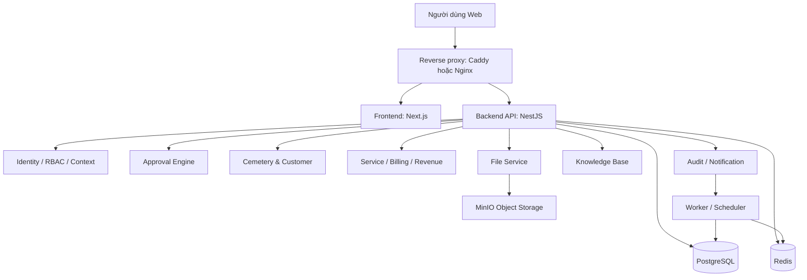
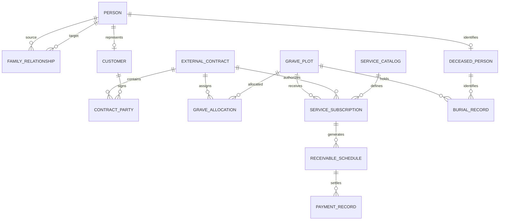

# Tổng hợp nền tảng quản lý doanh nghiệp

> Phiên bản: 1.0 — 24/08/2026  
> Phạm vi ưu tiên: quản lý mộ, khách hàng, dịch vụ, doanh thu; đồng thời xây nền tảng quyền và phê duyệt để mở rộng các phân hệ khác.

# Phần 1 — Các yêu cầu

## 1. Mục tiêu hệ thống

Xây dựng một nền tảng web quản lý tập đoàn/công ty có thể dùng chung cho các nghiệp vụ: quản lý mộ, khách hàng, phòng họp, xe, mua hàng, duyệt giá, tài liệu và tri thức nội bộ. Hệ thống phải bảo đảm cùng một người có thể làm nhiều vai trò ở nhiều bối cảnh tổ chức mà quyền, phạm vi dữ liệu và luồng phê duyệt vẫn đúng.

## 2. Tổ chức, user và phân quyền

### 2.1. Cơ cấu tổ chức

```text
Tập đoàn → Công ty → Chi nhánh (nếu có) → Phòng ban → User
```

- Một user có một chức danh chính tại đơn vị chính.
- Một user có thể có nhiều vai trò bổ sung ở một hoặc nhiều phòng ban/công ty.
- Vai trò có ngày bắt đầu, ngày kết thúc, trạng thái và phạm vi tổ chức.
- Thay đổi nhân sự không được làm thay đổi lịch sử nghiệp vụ cũ.

### 2.2. Organizational context

Khi tạo/gửi/duyệt một nghiệp vụ, user làm việc trong một context:

```text
User + Position/Role + Organization Unit + Business Domain + Scope
```

Ví dụ: ông A dùng context Chuyên viên CNTT/Phòng CNTT để tạo mua hàng thì đi luồng CNTT; khi dùng context Tuyển dụng/Phòng HCNS thì đi luồng HCNS. Context được lưu snapshot vào từng yêu cầu.

### 2.3. Permission matrix

Permission có cấu trúc `module.resource.action`, ví dụ:

```text
cemetery.customer.create
cemetery.grave.hold
cemetery.contract.verify
cemetery.service.subscription.renew
cemetery.revenue.confirm_payment
purchase.request.approve
```

Phạm vi dữ liệu chuẩn: `SELF`, `ASSIGNED`, `DEPARTMENT`, `COMPANY`, `GROUP`, `CUSTOM`.

Quyền phải được kiểm tra tại backend. Việc ẩn/hiện nút trên giao diện chỉ hỗ trợ trải nghiệm, không phải bảo mật.

## 3. Approval workflow

- Nhiều cấp, tuần tự hoặc song song.
- Điều kiện theo loại yêu cầu, công ty, phòng ban, số tiền, loại mộ/dịch vụ, giảm giá hoặc ngoại lệ.
- Người duyệt được tìm bằng quy tắc: trưởng bộ phận, giám đốc công ty, holder của chức danh/vai trò, chủ ngân sách hoặc user chỉ định.
- Approve, reject, return for revision, cancel, delegation, escalation và SLA.
- Workflow được version hóa. Yêu cầu đang chạy giữ version tại thời điểm gửi.
- Người tạo không được tự duyệt yêu cầu của mình nếu policy không cho phép.

## 4. Yêu cầu phân hệ quản lý mộ

### 4.1. Mộ và vị trí

- Cây nghĩa trang: khu → phân khu → lô → dãy → vị trí mộ.
- Loại mộ, sức chứa, giá tham chiếu, trạng thái và sơ đồ/danh sách.
- Trạng thái tối thiểu: Available, Held, Reserved, Allocated, Occupied, Maintenance, Locked.
- Giữ chỗ có thời hạn; hai user không được giữ cùng một mộ.
- Lịch sử thay đổi trạng thái, người thực hiện, lý do và file liên quan.

### 4.2. Person, khách hàng và quan hệ gia đình

- `Person` là hồ sơ cá nhân gốc; Customer cá nhân và Deceased Person dùng chung Person khi cùng một người.
- Khách hàng tổ chức là một loại chủ thể riêng, không có quan hệ gia đình.
- Tách người ký/chủ mộ, người thanh toán, người liên hệ và người được an táng.
- Quan hệ gia đình trực tiếp có hai chiều: chồng/vợ, cha-mẹ/con, anh-chị-em.
- Nhập A là chồng B thì tự tạo B là vợ A; thay đổi/đóng một chiều phải đồng bộ chiều còn lại.
- Quan hệ có trạng thái Pending, Confirmed, Disputed, Ended và nguồn xác minh.
- Không tự suy ra họ hàng xa hoặc dùng quan hệ gia đình để tự cấp quyền truy cập/chuyển quyền.
- Tìm chống trùng theo CCCD đã băm, điện thoại, email và tên gần đúng; chỉ cảnh báo, không tự merge.

### 4.3. Hợp đồng ký ngoài hệ thống

- Hợp đồng được ký ngoài hệ thống và upload PDF/ảnh vào hệ thống.
- Bắt buộc nhập/xác nhận thông tin cấu trúc: số hợp đồng, bên ký, mộ, thời hạn, giá trị, điều khoản thu và file gốc.
- Có checklist và người xác minh; chỉ hợp đồng đã xác minh/kích hoạt mới phân bổ mộ, sinh dịch vụ và lịch thu.
- Phụ lục/thay đổi tạo version/revision mới; không sửa âm thầm hợp đồng đã kích hoạt.

### 4.4. Dịch vụ chăm sóc mộ, thời hạn và doanh thu

- Danh mục dịch vụ: mã, tên, mô tả, giá tham chiếu, chu kỳ thu, thời hạn mặc định và mốc nhắc hạn.
- Đăng ký dịch vụ gắn với quyền sử dụng mộ/hợp đồng, không gắn cứng với một cá nhân chủ mộ.
- Mỗi đăng ký có ngày bắt đầu/kết thúc, giá thỏa thuận, trạng thái, bên thanh toán và mộ/hợp đồng liên quan.
- Tự sinh ngày hết hạn và lịch khoản phải thu theo điều khoản đã xác minh.
- Nhắc hết hạn theo cấu hình, mặc định 90/60/30/7 ngày; hỗ trợ gia hạn, tạm dừng, hủy và điều chỉnh.
- Theo dõi tách biệt: doanh thu dự kiến, khoản phải thu, số đã thu, còn phải thu, quá hạn, miễn giảm/điều chỉnh.
- Cho phép import/xác nhận thanh toán từ hệ thống kế toán bên ngoài; không làm sổ kế toán tổng hợp/hóa đơn điện tử trong MVP.
- Giai đoạn mở rộng: lịch chăm sóc, giao việc, checklist, ảnh trước/sau, đánh giá chất lượng thực hiện.

### 4.5. Hồ sơ an táng

- Người được an táng, ngày an táng, vị trí mộ, hợp đồng và giấy tờ chứng minh.
- Giới hạn số hồ sơ an táng theo sức chứa cấu hình của mộ.
- Hồ sơ pháp lý/file nhạy cảm được bảo vệ theo quyền và có lịch sử truy cập.
- Hoàn tất an táng chuyển trạng thái mộ phù hợp và ghi audit.

## 5. Các phân hệ mở rộng

| Phân hệ | Yêu cầu cốt lõi |
|---|---|
| Khách hàng chung | Customer 360, liên hệ, file, lịch sử, chống trùng, phân quyền theo scope |
| Mua hàng | Yêu cầu mua, hạn mức, nhiều cấp duyệt, file báo giá, theo dõi trạng thái |
| Phòng họp | Tài nguyên phòng, lịch, chống trùng, duyệt khi cần, báo cáo sử dụng |
| Xe | Xe/tài xế, yêu cầu điều xe, lịch, chống trùng, duyệt và lịch sử |
| Duyệt giá | Đề xuất giá/giảm giá, version, hạn dùng, điều kiện duyệt và audit |
| Knowledge base | Note, tài liệu, tag, liên kết, tìm kiếm, mind map/knowledge graph theo quyền |

## 6. File, thông báo, dashboard, audit và bảo mật

### 6.1. File

- Upload file/hình ảnh, version file, checksum, giới hạn dung lượng/loại file, virus scan.
- File nhạy cảm (CCCD, giấy chứng tử, hợp đồng) có permission riêng và signed URL ngắn hạn.

### 6.2. Thông báo

- In-app notification, email; có queue và retry.
- Nhắc phê duyệt, quá SLA, hold hết hạn, dịch vụ sắp hết hạn, hợp đồng hết hạn, khoản thu quá hạn.

### 6.3. Dashboard

- Dashboard tổng quan theo quyền/context.
- Dashboard quản lý mộ: trạng thái mộ, hold sắp hết hạn, hợp đồng/dịch vụ sắp hết hạn, lịch an táng, khoản phải thu.
- Dashboard doanh thu: dự kiến, đã thu, còn phải thu, quá hạn; lọc ngày/tháng/quý/năm, công ty, khu mộ, loại mộ, dịch vụ và khách hàng.
- Mỗi KPI drill-down về bản ghi nguồn; filter không được làm lộ dữ liệu ngoài scope.

### 6.4. Audit/check log

- Audit nghiệp vụ: trước/sau, ai, context, lúc nào, đối tượng nào, lý do, kết quả.
- Security log: login, access denied, đổi quyền, download/export file nhạy cảm.
- System log: lỗi API, job, worker, storage và database.
- Màn hình Audit & Check Log có filter theo thời gian, user, company, action, entity, kết quả và correlation ID.
- Audit append-only, có cơ chế kiểm tra integrity; user nghiệp vụ không xóa/sửa được.

## 7. Yêu cầu phi chức năng

- Web responsive, hỗ trợ Chrome/Edge hiện hành; giao diện tiếng Việt, định dạng tiền tệ VND, múi giờ Asia/Bangkok/Việt Nam.
- API có OpenAPI; lỗi chuẩn hóa, pagination, filter, sort, export đúng quyền.
- Có migration, seed UAT, backup/restore, health check, monitoring và log rotation.
- Không lưu binary file trong database; không lưu mật khẩu/token/file nhạy cảm trong log.
- Có unit test, integration test, end-to-end test cho luồng critical.

# Phần 2 — Các giải pháp

## 8. Kiến trúc tổng thể được đề xuất

Giai đoạn đầu dùng **modular monolith**: một backend, một PostgreSQL, một codebase nhưng chia ranh giới module. Cách này nhanh phát triển, dễ audit transaction và phù hợp hệ thống mới. Chỉ tách microservice khi có tải, nhóm phát triển hoặc tích hợp thực tế buộc phải tách.



## 9. Frontend

### 9.1. Công nghệ

| Thành phần | Đề xuất | Mục đích |
|---|---|---|
| Framework | Next.js App Router + TypeScript | Web app hiện đại, route/layout rõ, tối ưu tải trang |
| UI | Tailwind CSS + shadcn/ui | Giao diện nhất quán, nhanh xây form/table/dialog |
| Data fetching | TanStack Query | Cache, loading/error state, invalidation đúng nghiệp vụ |
| Form/validation | React Hook Form + Zod | Form phức tạp, validate trước khi gọi API |
| Table/filter | TanStack Table | Danh sách lớn, lọc, sort, phân trang |
| Charts | Apache ECharts | Dashboard và drill-down |
| Mind map | React Flow | Giai đoạn knowledge graph/mind map |

Next.js App Router hiện hỗ trợ Server Components, Suspense và Server Functions; phù hợp cho dashboard, layout phân hệ và form nghiệp vụ phức tạp. [Tài liệu Next.js](https://nextjs.org/docs/app)

### 9.2. Cấu trúc giao diện

```text
app/
  (auth)/login
  (app)/dashboard
  (app)/cemetery/customers
  (app)/cemetery/graves
  (app)/cemetery/contracts
  (app)/cemetery/services
  (app)/cemetery/revenue
  (app)/approvals/inbox
  (app)/audit
  (app)/knowledge
  (admin)/organization
  (admin)/roles-permissions
  (admin)/workflows
```

Giao diện phải có context switcher ở thanh đầu trang: user biết đang làm việc với vai trò/phòng ban nào trước khi tạo hoặc duyệt nghiệp vụ.

## 10. Backend và API

### 10.1. Công nghệ

| Thành phần | Đề xuất | Mục đích |
|---|---|---|
| Runtime/ngôn ngữ | Node.js LTS + TypeScript | Một ngôn ngữ xuyên suốt frontend/backend |
| Backend framework | NestJS | Module, DI, guard, validation, OpenAPI, worker integration |
| API | REST JSON + OpenAPI 3.x | Dễ tích hợp web, mobile, hệ thống kế toán sau này |
| ORM/migration | Prisma hoặc Drizzle + migration SQL review | Type safety nhưng vẫn kiểm soát schema/migration |
| Job queue | Redis + BullMQ | Nhắc hạn, expiry hold, thông báo, import file, export |
| Validation | Zod hoặc class-validator | Validate DTO ở ranh giới API |
| Auth | JWT access token ngắn hạn + refresh rotation; MFA cho production | Đăng nhập và quản trị phiên |

NestJS hỗ trợ RBAC và claims/permission-based authorization thông qua guard/policy; hệ thống này phải kiểm tra permission và scope trong service/API, không chỉ role tại controller. [Tài liệu NestJS](https://docs.nestjs.com/security/authorization)

### 10.2. Cấu trúc module backend

```text
apps/api/src/modules/
  iam/              user, login, MFA, session
  organization/     company, department, position, assignment, context
  authorization/    permission, role, scope, policy evaluator
  workflow/         definition, version, resolver, approval instance
  cemetery/         person, customer, family, grave, hold, burial
  contracts/        external contract, revision, verification
  services/         catalog, subscription, renewal, expiry
  billing/          receivable, payment import, adjustment, report
  files/            metadata, upload, download, scan
  audit/            audit event, security event, check log
  notification/     email, in-app, template, queue
  knowledge/        documents, notes, tags, graph
  reporting/        dashboard queries, export
```

### 10.3. API nguyên tắc

- Prefix: `/api/v1`.
- Mỗi request có `X-Correlation-ID`; mọi audit/system log cùng correlation ID.
- `GET` có cursor/offset pagination, filter/sort whitelist và giới hạn export.
- Các action nghiệp vụ dùng endpoint rõ nghĩa: `POST /grave-holds`, `POST /contracts/{id}/verify`, `POST /service-subscriptions/{id}/renew`.
- Không dùng một endpoint `PATCH` tổng quát để chuyển trạng thái nhạy cảm.
- OpenAPI là hợp đồng giữa frontend/backend; API integration dùng service account riêng và scope company rõ ràng.

## 11. Database — PostgreSQL

### 11.1. Lựa chọn

Dùng **PostgreSQL** cho development và production. Đây là database giao dịch chính, bảo đảm transaction cho giữ chỗ/phân bổ mộ, relationship pair, approval và audit. Các bảng multi-company luôn có `tenant_id`/`company_id` phù hợp.

PostgreSQL có Row-Level Security (RLS) để làm lớp phòng vệ bổ sung theo từng row. Không dùng RLS thay cho business authorization; triển khai sau khi policy/scope đã ổn định. [Tài liệu PostgreSQL RLS](https://www.postgresql.org/docs/current/ddl-rowsecurity.html)

### 11.2. Schema/database domain

| Schema | Bảng chính | Mục đích |
|---|---|---|
| `iam` | users, sessions, mfa_methods, service_accounts | Định danh, đăng nhập, session |
| `org` | organization_units, positions, user_assignments, contexts | Tập đoàn/công ty/phòng ban/context |
| `authz` | roles, permissions, role_permissions, scope_policies, delegations | RBAC + scope + ủy quyền |
| `workflow` | definitions, versions, nodes, transitions, instances, steps, actions | Phê duyệt đa cấp |
| `cemetery` | persons, customers, family_relationships, grave_plots, holds, burial_records | Khách hàng/mộ/người mất |
| `contracts` | external_contracts, parties, revisions, verification_checklists | Hợp đồng upload ngoài |
| `services` | catalog, subscriptions, renewals, expiry_rules | Dịch vụ và hạn dùng |
| `billing` | receivable_schedules, payment_records, adjustments, import_batches | Phải thu/đã thu/doanh thu |
| `files` | file_objects, file_links, scan_results | Metadata file và liên kết |
| `audit` | events, security_events, export_events | Audit/check log append-only |
| `knowledge` | documents, notes, tags, links, embeddings | Tri thức và graph |
| `common` | outbox_events, notifications, settings | Event, notification, cấu hình |

### 11.3. Cơ sở dữ liệu quản lý mộ



Các bảng/logic quan trọng:

| Đối tượng | Trường/logic bắt buộc |
|---|---|
| `persons` | tên, giới tính, ngày sinh, CCCD được bảo vệ/băm để dò trùng, trạng thái |
| `family_relationships` | `source_person_id`, `target_person_id`, type, reciprocal_id, status, effective dates; insert cặp quan hệ cùng transaction |
| `grave_plots` | mã mộ duy nhất theo company, sức chứa, loại, trạng thái, version cho optimistic locking |
| `grave_holds` | mộ, khách hàng, creator, expires_at, status; chỉ một hold active cho một mộ |
| `external_contracts` | file gốc, dữ liệu cấu trúc, status, version, verified_by, verified_at |
| `service_subscriptions` | mộ, hợp đồng, gói, giá chốt, effective_from/to, bên thanh toán, status |
| `receivable_schedules` | loại phí, due date, expected amount, status; không sửa trực tiếp khoản paid |
| `payment_records` | số tham chiếu ngoài duy nhất, số tiền, ngày thu, import batch, trạng thái đối soát |

### 11.4. Ràng buộc và hiệu năng

- UUID/ULID làm primary key; mã nghiệp vụ có unique constraint.
- Soft delete chỉ cho master data chưa phát sinh; hợp đồng/mộ/audit/lịch thu không xóa cứng.
- Unique partial index: chỉ một `grave_hold` Active và một allocation Active cho mỗi grave plot.
- Optimistic locking cho hold/allocation để chặn double-booking.
- Index tối thiểu: `(company_id, status)`, `(company_id, created_at)`, `(entity_type, entity_id)`, `(due_date, status)`, `(effective_to, status)`.
- Snapshot giá, bên ký, điều khoản thu, context và workflow version vào dữ liệu giao dịch để lịch sử không đổi theo master data.
- Migration là bắt buộc; không sửa schema trực tiếp trên production.

## 12. File storage, search và knowledge base

### 12.1. File

Dùng **MinIO** tương thích S3 cho local/on-premise; PostgreSQL chỉ lưu metadata. Object gồm `storage_key`, checksum, MIME type, kích thước, scan status, sensitivity và người upload.

```text
UI xin signed upload URL → upload MinIO → virus scan → file Clean → API liên kết với hợp đồng/hồ sơ
```

Không public MinIO hoặc bucket trực tiếp ra Internet. Chỉ API cấp signed URL ngắn hạn sau khi kiểm tra permission.

### 12.2. Search/knowledge

- Giai đoạn đầu: PostgreSQL full-text search, tag, link, version note/document.
- Giai đoạn sau: `pgvector` cho semantic search, graph node/edge cho mind map.
- Mọi tài liệu/embedding mang company/scope/sensitivity để search không vượt quyền.

## 13. Cấu hình server, Docker và cổng dịch vụ

### 13.1. Môi trường

| Môi trường | Mục đích | Cấu hình khuyến nghị |
|---|---|---|
| Local development | Lập trình trên máy cá nhân | 8 logical cores, 16 GB RAM, 100 GB SSD trống; Docker Desktop/WSL2 |
| UAT/Staging | Người dùng kiểm thử | 4–8 vCPU, 16 GB RAM, 250 GB SSD/NVMe, backup hằng ngày |
| Production nhỏ ban đầu | Tối đa quy mô nhỏ/trung bình | 8 vCPU, 32 GB RAM, 500 GB NVMe RAID/backup; UPS và mạng ổn định |
| Production tách lớp | Khi nhiều user/file | App/worker: 4–8 vCPU, 16 GB; Database: 8 vCPU, 32–64 GB, NVMe; Object storage và backup tách riêng |

Con số cuối cùng phải đo lại theo số user đồng thời, dung lượng file/năm và tần suất báo cáo. PostgreSQL và object storage thường là hai phần cần ưu tiên dung lượng/backup trước.

### 13.2. Docker Compose services

```text
reverse-proxy  Caddy hoặc Nginx; TLS, route web/api
web            Next.js production build
api            NestJS REST API
worker         BullMQ scheduler/jobs (nhắc hạn, expiry, import/export)
postgres       PostgreSQL
redis          queue/cache/lock
minio          file object storage
clamav         quét virus file (khuyến nghị production)
mailpit        mail test (chỉ development/UAT)
```

### 13.3. Cổng dịch vụ đề xuất

| Service | Port | Expose ra ngoài? | Ghi chú |
|---|---:|---|---|
| HTTPS reverse proxy | 443 | Có | Cổng duy nhất cho user production |
| HTTP redirect | 80 | Có | Chuyển sang HTTPS |
| Next.js | 3000 | Không | Chỉ Docker internal/reverse proxy |
| NestJS API | 4000 | Không | Chỉ Docker internal/reverse proxy |
| PostgreSQL | 5432 | Không | Chỉ app/backup admin network riêng |
| Redis | 6379 | Không | Chỉ internal |
| MinIO S3 API | 9000 | Không | Chỉ app/reverse proxy có kiểm soát |
| MinIO Console | 9001 | Không | Chỉ admin qua VPN/internal |
| Mailpit UI | 8025 | Chỉ dev/UAT | Tuyệt đối không production public |

Không mở 5432, 6379, 9000, 9001 trực tiếp ra Internet.

### 13.4. Cấu hình môi trường

Chỉ commit `.env.example`, không commit secret. Nhóm cấu hình tối thiểu:

```text
APP_ENV, APP_URL, API_URL
DATABASE_URL
REDIS_URL
S3_ENDPOINT, S3_BUCKET, S3_ACCESS_KEY, S3_SECRET_KEY
JWT_ACCESS_SECRET, JWT_REFRESH_SECRET, ENCRYPTION_KEY
SMTP_HOST, SMTP_PORT, SMTP_USER, SMTP_PASSWORD
VIRUS_SCAN_ENABLED
AUDIT_RETENTION_DAYS, FILE_MAX_SIZE_MB
```

Secret production để trong secret manager hoặc file quyền đọc chỉ dành cho service account; thay khóa theo quy trình có kiểm soát.

## 14. Bảo mật, audit và vận hành

- Mật khẩu Argon2id; token access ngắn hạn, refresh rotation, MFA cho admin/approver/auditor.
- Global authentication guard; permission + scope + context ở API/service layer.
- Rate limiting login/API; CORS/CSP; HTTPS bắt buộc production.
- Audit append-only cho quyền, workflow, hợp đồng, mộ, dịch vụ, giá, file, payment import/export.
- Tách audit business, security log và system log; không log PII hoặc request body không cần thiết.
- Backup PostgreSQL hằng ngày, object storage version/replication; diễn tập restore định kỳ.
- Health check `/health`, metrics, alert khi database/storage/job queue lỗi hoặc reminder không chạy.

## 15. Lộ trình module và yêu cầu nghiệm thu

| Giai đoạn | Module | Kết quả cần đạt | Nghiệm thu tối thiểu |
|---|---|---|---|
| P0 | Phân tích/UAT data | Từ điển dữ liệu, quyền, 3 workflow, dữ liệu mẫu | Chủ nghiệp vụ ký flow và acceptance criteria |
| P1 | IAM, tổ chức, RBAC/context | Login, role, scope, context switcher, audit nền | User CNTT/HCNS cùng một người có quyền/luồng đúng theo context |
| P2 | Mộ, Person/Customer, family | Danh mục mộ, customer 360, quan hệ hai chiều, chống trùng | A là chồng B tự sinh B là vợ A; không double-hold; audit đầy đủ |
| P3 | Hợp đồng ngoài, hold, allocation | Upload/xác minh/version hợp đồng, phân bổ mộ | Không active contract nếu thiếu file/điều khoản; chặn allocate trùng |
| P4 | Dịch vụ, expiry, doanh thu | Service catalog, subscription, reminder, receivable/payment import, report | Tính đúng end date/kỳ thu; nhắc hạn đúng; không duplicate payment import |
| P5 | Hồ sơ an táng | Người mất, giấy tờ, sức chứa, trạng thái mộ | Không vượt capacity; file nhạy cảm đúng quyền; timeline/audit đúng |
| P6 | Approval dùng chung + module khác | Workflow designer có kiểm soát, mua hàng/phòng họp/xe/duyệt giá | Mỗi module dùng lại permission/audit/file/workflow, không sao chép logic |
| P7 | Knowledge/dashboard nâng cao | Knowledge graph, mind map, semantic search, KPI nâng cao | Search theo quyền, dashboard drill-down về bản ghi gốc |

### Bộ UAT bắt buộc cho quản lý mộ

1. Hai user cùng giữ một mộ: chỉ một giao dịch thành công.
2. A là chồng B: tạo đủ cặp quan hệ; khi đóng quan hệ, cả hai chiều cập nhật và audit.
3. Hợp đồng upload thiếu điều khoản: không kích hoạt/không sinh lịch thu.
4. Dịch vụ 12 tháng từ 01/01: hệ thống tính đúng hạn, khoản thu và nhắc hạn theo cấu hình.
5. Import thanh toán lặp mã tham chiếu: bị chặn, không tăng số đã thu.
6. User công ty A gọi API xem hồ sơ restricted công ty B: nhận 403 và có security log.
7. Báo cáo doanh thu lọc theo thời gian: tách đúng dự kiến, phải thu và đã thu.
8. Khôi phục backup mẫu: PostgreSQL, file và audit kiểm tra được.

## 16. Các quyết định cần chốt trước khi code

1. Một mộ có thể chứa bao nhiêu người theo từng loại mộ?
2. Quyền sử dụng mộ có thời hạn, vĩnh viễn hay tùy hợp đồng? Có chuyển nhượng/thừa kế không?
3. Ai là bên thanh toán khi chủ mộ mất, thay đổi đại diện hoặc chuyển nhượng?
4. Danh mục dịch vụ, công thức giá, chu kỳ thu và mốc nhắc hạn thực tế.
5. “Đã thu” được ghi nhận bằng import từ kế toán, nhập tay có phê duyệt, hay tích hợp API?
6. Đơn vị nào xem được CCCD, giấy chứng tử, giá hợp đồng và file nhạy cảm?
7. Các workflow đầu tiên cần làm: hợp đồng ngoài, giảm giá, thay đổi mộ, gia hạn dịch vụ hay mua hàng?

## Kết luận kiến trúc

```text
Next.js + TypeScript (frontend)
NestJS + TypeScript + REST/OpenAPI (backend)
PostgreSQL (transactional database)
Redis + BullMQ (queue, scheduler, lock)
MinIO S3-compatible (file/image)
Docker Compose + Caddy/Nginx (local/on-premise deployment)
Modular monolith + RBAC/scope/context + versioned approval engine
Audit-first + backup/restore + UAT theo module
```

Đây là kiến trúc cân bằng cho việc chạy local/on-premise trước, nhưng vẫn đủ đường mở rộng khi số công ty, user, hợp đồng, file và workflow tăng lên.

